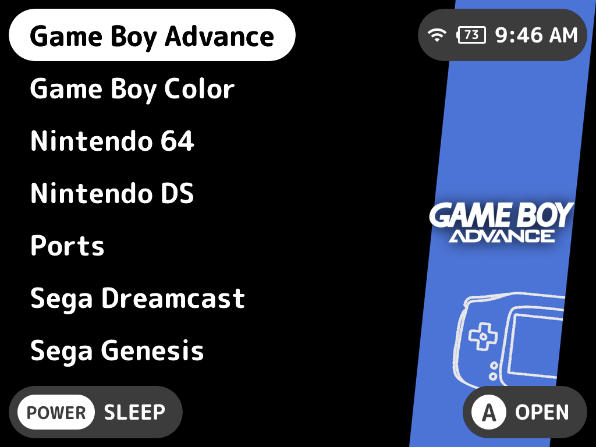

# Art Book Outline NextUI Theme

## Acknowledgment
- I modified the Art Book NextUI Theme by Timothy Bueno which can be found on [GitHub](https://github.com/Leviathanium/NextUI-Themes/raw/main/Packages/themes/ArtBookNextUI.theme.zip) as well at the [NextUI Themes repo](https://github.com/Leviathanium/NextUI-Themes?tab=readme-ov-file). 
- I wanted an Outline version of Art Book Next by Anthony Caccese, so I make this theme from his work, which can be found on [GitHub](https://github.com/anthonycaccese/art-book-next-es-de).

## Acknowledgments copied forward from Timothy Bueno
- Most system logos were sourced and modified from the excellent work done by Dan Patrick here. I modified each to be compatible with EmulationStation's current SVG support.
- ChangaOne font is by Eduardo Tunni
- Oxygen font is by Vernon Adams
- Auto-Collection Genre background art created by @nautipuss
- Metadata Icons sourced from FontAwesome
- The Noir System Artwork set was created and provided by tenlevels with help from f8less and inspired by the artwork from the Epic Noir theme by chicuelo
- The Outline System Artwork set was created and provided by Joppa Fallston, inspired by denizonm's work.
- Some System Artwork was created and provided by theUnBurn
- Thank you to GenoCL for the idea of the multi-artwork system view. It got me to think about ES themes in a different way when building it out and it came out awesome.

## License

Creative Commons CC-BY-NC-SA - https://creativecommons.org/licenses/by-nc-sa/2.0/ You are free to share and adapt this theme as long as you provide attribution back to me (and the above credits) as well share any updates you make under the same licence terms.
